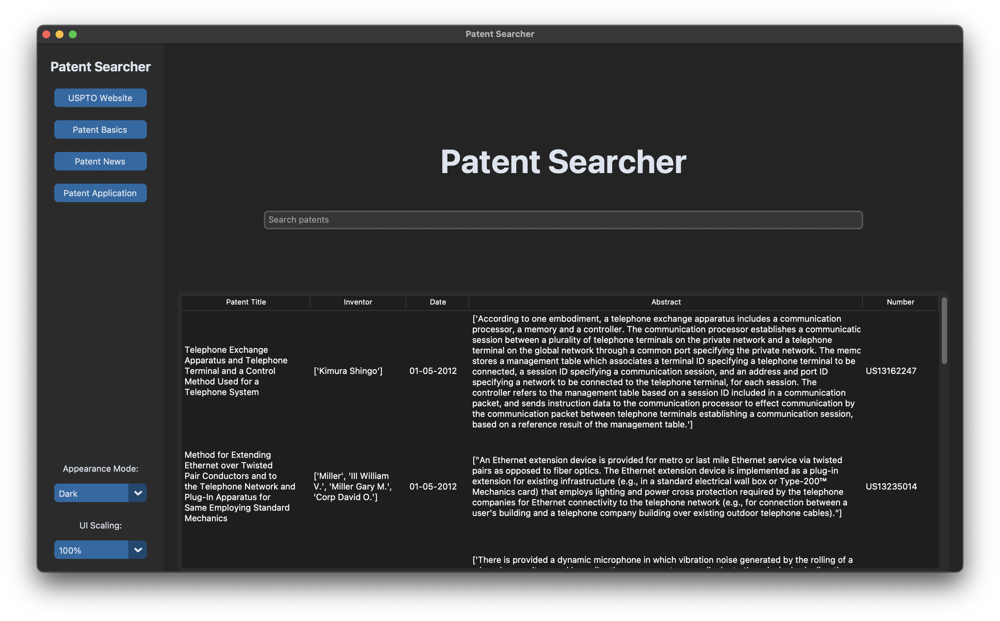

# Patent Searcher Desktop GUI

## Approach

I wanted to create a quick way to search for U.S. patents. For the tech stack, I used Python & Tkinter (a Python library to create user interfaces). 

I also utilized the U.S. Patent & Trademark Office's Search API to access its patent database. 

## How to run it

After downloading the python script, you can run it in the terminal with this command:

    $ python3 root.py

Alternatively, you can open up the python script in a code editor like Visual Studio Code and click the play button in the top right corner.